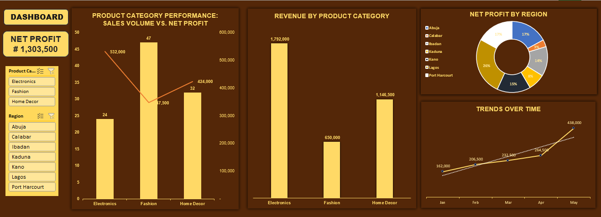

# Retail Revenue Optimization & Regional Analysis

## 📊 Project Overview
I developed this interactive Retail Revenue Optimization dashboard in Microsoft Excel to transform raw, unstructured transaction data into actionable commercial insights. The project focuses on tracking core financial KPIs, evaluating product performance, and identifying regional sales trends to drive strategic business growth.

## 🛠️ Key Features & Technical Stack
- **Data Cleaning & Standardization:** Standardized order profiles, corrected text identifiers, and structured transaction dates to ensure baseline data integrity.
- **Dynamic Data Modeling:** Engineered scalable Excel table calculations for Total Revenue, Total Cost, and Net Profit.
- **Advanced Interactive UI:** Developed a centralized executive canvas featuring a dual-axis combination chart (Sales Volume vs. Net Profit), regional distribution analysis, and monthly trend tracking.
- **Cross-Connected Filters:** Implemented dynamic slicers linked via customized Report Connections for real-time data drilling across Product Categories and Regions.

## 🔍 Key Insights
- **Top Revenue Driver:** Electronics generated the highest profitability, delivering ₦532,000 in net profit despite lower transaction volumes.
- **High-Velocity Category:** Fashion moved the highest number of individual units (47 units) but yielded lower net profit margins.
- **Regional Performance:** The regional distribution highlights key performance clusters that can be leveraged for targeted marketing and inventory allocation.

## 💻 Dashboard Preview
# retail-revenue-optimization
